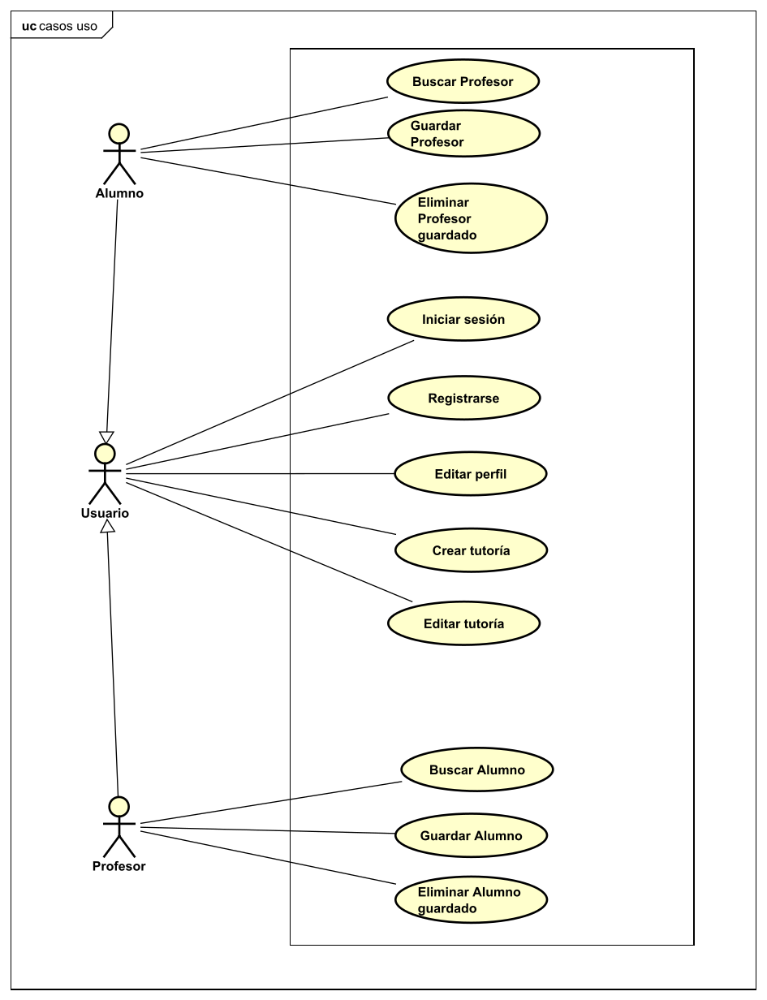

<h1>Documento resumen del proyecto para crear la aplicación "TutorUVa"</h1>

<ol>
<h2><li>Resumen del proyecto</li></h2>

Esta aplicación servirá para gestionar las tutorías entre los alumnos y los profesores. Esta aplicación está adaptada para la Universidad de Valladolid pero se trata solo de un proyecto con fines de aprendizaje. Además se podría adaptar a cualquier otra universidad cambiando los campos específicos a la Universidad de Valladolid. En la aplicación, existen dos tipos de usuarios los profesores o los alumnos. Cualquiera de ellos puede crear una tutoría, definiendo que profesor y que alumno van a participar en ella. Para la tutoría se deben acordar fecha, hora de inicio y fin descripción. Estos detalles de la tutoría se pueden editar tanto por el profesor como por el alumno. El profesor y el alumno participante de la tutoría pueden aceptar, rechazar o proponer cambios en las condiciones de la tutoría. Los alumnos en la aplicación pueden guardar sus profesores que les den clase y los profesores pueden guardar sus alumnos a los que den clase para acceder rápidamente a ellos.

<h2><li>Aplicaciones similares</li></h2>

No hay aplicaciones similares que cumplan el objetivo de este proyecto pero si se han utilizado las aplicaciones Web de la Universidad de Valladolid como referencias en términos de diseño.

<h2><li>Tecnologías utilizadas</li></h2>

Se va aplicar una estructura MERN stack compuesta por las siguientes tecnologías:

<ul>
<li>Frontend: React y Tailwind</li>
<li>Backend: NodeJS y ExpressJS</li>
<li>Base de datos: MongoDB</li>
</ul>

<h2><li>Funcionalidad de la aplicación. Casos de uso</li></h2>

A continuación se expone el diagrama de casos de uso de la aplicación:

<h2><li>Diagrama de clases</li></h2>

A continuacion se expone el diagrama de clases de la aplicación:

<h2><li>Estructura de la base de datos</li></h2>

A continuación se expone el diagrama con las relaciones entre las colecciones de la base de datos de la aplicación:

<h2><li>Estructura del backend</li></h2>

La estructura del backend va a consistir en una API REST creada con ExpressJS de manera que el frontend haga las peticiones al backend con las operaciones que quiere realizar sobre la base de datos. Existe un fichero que controla estas peticiones y dependiendo la petición que sea llama al archivo Javascript correspondiente que realice la acción deseada.
Por lo tanto en el backend existe la carpeta controladores que tiene los archivos que realizan las operaciones sobre cada determinada colección, la carpeta modelos que tiene los archivos con las clases definidas en el diagrama de clases para gestionar los datos y la carpeta ruta que tiene todas rutas de la APIREST en ExpressJS. 

<h2><li>Estructura del frontend</li></h2>
La aplicación contará con las siguientes vistas:
<ul>
<li>PantallaPrincipal: esta vista funcionará como una landing page.</li>
<li>Identificación: esta vista contará con un formulario para que el usuario se identifique. Se mostrará como una ventana de diálogo.</li>
<li>Registro: esta vista contará con un formulario para que el usuario se registre. Se mostrará como una ventana de diálogo.</li>
<li>MiUsuario: esta vista mostrará los detalles del usuario y permitirá navegar a las demás vistas una vez el usuario se identifique.</li>
<li>EditarPerfil: en esta vista el usuario podrá editar los datos de su cuenta.</li>
<li>CrearTutoria: en esta vista un profesor o un alumno puede crear una tutoría rellenando un formulario con los detalles de la tutoría. Esta vista servirá también para editar los datos de una tutoría.</li>
<li>MisProfesores: en esta vista se mostrarán los profesores que guarde el alumno.</li>
<li>MisAlumnos: en esta vista se mostrarán los alumnos que guarde el profesor.</li>
<li>MisTutorias: en esta vista se mostrarán las tutorías en las que participe el usuario.</li>
<li>BuscadorAlumno: en esta vista se podrá buscar un alumno por su nombre.</li>
<li>BuscadorProfesor: en esta vista se podrá buscar un profesor por su nombre.</li>
<li>DetallesTutoria: en esta vista mostrará los detalles de la tutoría.</li>

</ul>
La navegación entre las diferentes vistas en la siguiente:

<h2><li>Bocetos del frontend</li></h2>
Se han realizado bocetos con Figma con la idea básica de como será la aplicación. Estos bocetos han servido de guía para el desarrollo de la aplicación, sin embargo durante el desarrollo se han encontrado mejoras sobre estos bocetos. Por lo tanto el resultado final, combina los bocetos con ideas aparecidas durante el desarrollo. Los bocetos se encuentran en el pdf adjunto bocetos-tutoruva.

<h2><li>Detalles de la aplicacion</li></h2>
<ul>

<li>Colores:
<ul>
<li>Azul oscuro utilizado en las páginas de la UVa:#0C1F4A</li>
<li>Morado utilizado en las páginas de la UVa:#AB1739</li>
<li>Blanco:#FFFFFF</li>
</ul>
</li>
</ul>
<h2><li>Registro del tiempo</li></h2>

El registro del tiempo es algo fundamental debido a la cantidad de tareas por realizar, además de este proyecto. Por lo tanto se definirá en la siguiente tabla la fecha, la hora de inicio, la hora final, el tiempo utilizado y una descripción de cada tarea realizada y cada trabajo realizado en el proyecto. Además este registro del tiempo sirve para estimar el tiempo de realización para trabajos futuros y para controlar que el esfuerzo en este proyecto no exceda los límites aceptables. 

<table>
<tr>
    <th>Fecha</th>
    <th>Hora de inicio</th>
    <th>Hora final</th>
    <th>Tiempo utilizado (en minutos)</th>
    <th>Descripción del trabajo realizado</th>
  </tr>
  <tr>
    <td>Sabado 20 de mayo</td>
    <td>9:00</td>
    <td>11:45</td>
    <td>165</td>
    <td>Realizar primeras partes documento resumen</td>
  </tr>

  <tr>
    <td>Sabado 20 de mayo</td>
    <td>13:45</td>
    <td>14:10</td>
    <td>25</td>
    <td>Realizar documento resumen</td>
  </tr>

  <tr>
    <td>Sabado 20 de mayo</td>
    <td>15:00</td>
    <td>16:00</td>
    <td>60</td>
    <td>Realizar documento resumen</td>
  </tr>

  <tr>
    <td>Sabado 20 de mayo</td>
    <td>17:15</td>
    <td>22:10</td>
    <td>295</td>
    <td>Realizar documento resumen</td>
  </tr>

   

 

  

  <tr>
    <td>Sabado 20 de mayo</td>
    <td>22:45</td>
    <td>2:05</td>
    <td>200</td>
    <td>Interfaces React</td>
  </tr>

  <tr>
    <td>Domingo 21 de mayo</td>
    <td>9:10</td>
    <td>12:25</td>
    <td>195</td>
    <td>Parte NodeJs</td>
  </tr>

  <tr>
    <td>Domingo 21 de mayo</td>
    <td>15:15</td>
    <td>16:55</td>
    <td>100</td>
    <td>Parte NodeJs</td>
  </tr>

  <tr>
    <td>Domingo 21 de mayo</td>
    <td>17:05</td>
    <td>18:55</td>
    <td>110</td>
    <td>Parte NodeJs</td>
  </tr>

  <tr>
    <td>Domingo 21 de mayo</td>
    <td>19:50</td>
    <td>20:15</td>
    <td>25</td>
    <td>Parte NodeJs</td>
  </tr>

   <tr>
    <td>Domingo 21 de mayo</td>
    <td>21:00</td>
    <td>21:35</td>
    <td>35</td>
    <td>Parte NodeJs</td>
  </tr>

  <tr>
    <td>Lunes 22 de mayo</td>
    <td>9:05</td>
    <td>10:15</td>
    <td>70</td>
    <td>Parte NodeJs</td>
  </tr>

  <tr>
    <td>Lunes 22 de mayo</td>
    <td>10:25</td>
    <td>11:10</td>
    <td>45</td>
    <td>Parte NodeJs</td>
  </tr>

   <tr>
    <td>Lunes 22 de mayo</td>
    <td>14:10</td>
    <td>14:30</td>
    <td>20</td>
    <td>Parte NodeJs</td>
  </tr>

  <tr>
    <td>Lunes 22 de mayo</td>
    <td>17:05</td>
    <td>17:20</td>
    <td>15</td>
    <td>Parte NodeJs</td>
  </tr>

   <tr>
    <td>Lunes 22 de mayo</td>
    <td>18:20</td>
    <td>19:05</td>
    <td>45</td>
    <td>Parte NodeJs</td>
  </tr>

 
  <tr>
    <td>Lunes 22 de mayo</td>
    <td>21:20</td>
    <td>22:00</td>
    <td>40</td>
    <td>Parte NodeJs</td>
  </tr>

 <tr>
    <td>Lunes 22 de mayo</td>
    <td>22:45</td>
    <td>0:00</td>
    <td>75</td>
    <td>Interfaces React</td>
  </tr>

  <tr>
    <td>Jueves 25 de mayo</td>
    <td>17:55</td>
    <td>19:05</td>
    <td>70</td>
    <td>Interfaces React</td>
  </tr>

  <tr>
    <td>Jueves 25 de mayo</td>
    <td>20:50</td>
    <td>22:00</td>
    <td>70</td>
    <td>Interfaces React</td>
  </tr>

  <tr>
    <td>Jueves 25 de mayo</td>
    <td>22:35</td>
    <td>23:35</td>
    <td>60</td>
    <td>Interfaces React</td>
  </tr>

  <tr>
    <td>Viernes 26 de mayo</td>
    <td>17:40</td>
    <td>18:35</td>
    <td>55</td>
    <td>Interfaces React</td>
  </tr>

   <tr>
    <td>Viernes 26 de mayo</td>
    <td>20:55</td>
    <td>22:10</td>
    <td>75</td>
    <td>Interfaces React</td>
  </tr>

   <tr>
    <td>Viernes 26 de mayo</td>
    <td>22:50</td>
    <td>0:00</td>
    <td>70</td>
    <td>Interfaces React</td>
  </tr>
 
  
  
</table>

<strong>Tiempo empleado: 1920 minutos (32 horas)</strong>

<h2><li>Resultado final: vídeo youtube y repositorio</li></h2>
Repositorio Github:

<h2><li>Conclusiones</li></h2>
He ampliado mis conocimientos con React y Tailwind. He profundizado en la creación de componentes en React. He aprendido a como acceder a una base de datos de MongoDB mediante NodeJS y como crear una API REST con ExpressJS.

</ol>